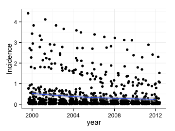
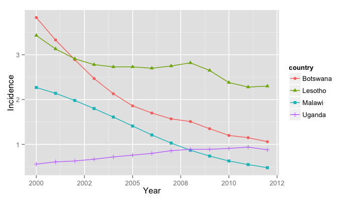
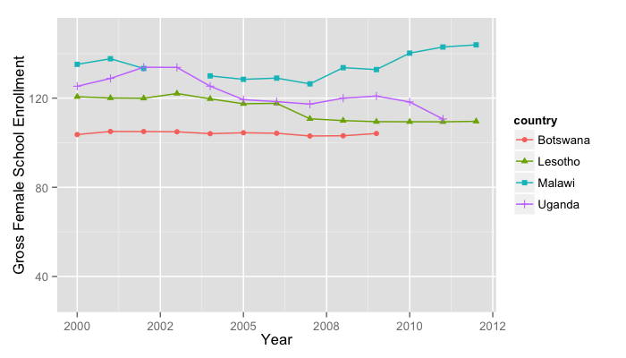
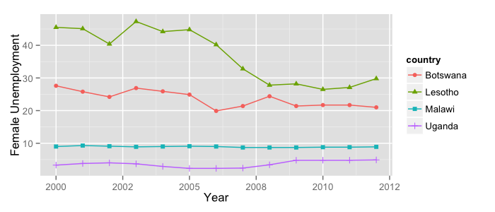
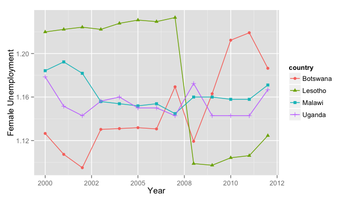
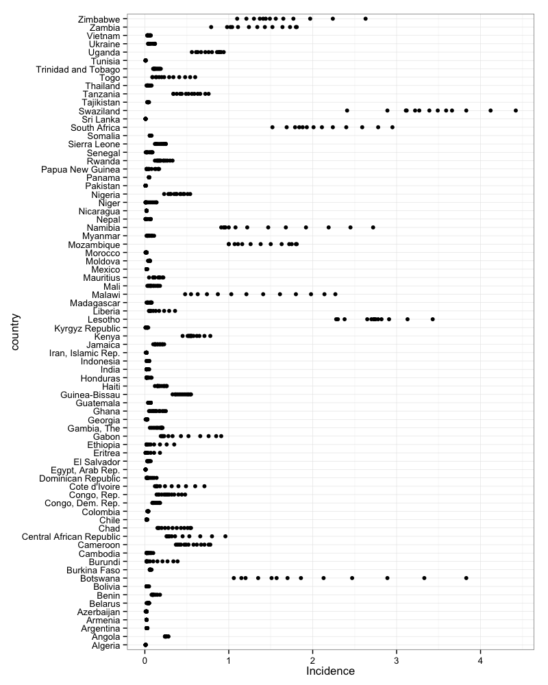
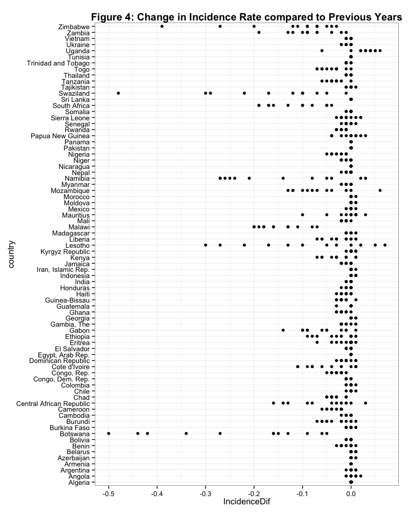

```{r, echo=FALSE, include=FALSE, error=FALSE}
### 1. Setting Working Directory & Loading the data
# Setting the Working Directory
setwd("/Users/Meilin/Desktop/Collaborative Social Data/FinalProject")
# setwd("/Users/Nico/Documents/Hertie/Social science data analysis/Final project/FinalProject")

# Loading the Citations
pkgs <- c("RJSONIO","WDI","dplyr","tidyr","knitr","DataCombine","lmtest","httr","XML","plyr","Amelia","XLConnect","countrycode","ggplot2","magrittr","fmsb","car","stargazer")
repmis::LoadandCite(pkgs, file = 'RpackageCitations.bib')

# Loading the merged files from the Working directory
Merged <- read.csv(file="MergedData")
```


```{r, echo=FALSE, include=FALSE, error=FALSE}

### 2. Load Required Packages

# install.packages("RJOSONIO")  
library(RJSONIO)
# install.packages("WDI")  
library(WDI)
# install.packages("dplyr")  
library(dplyr) 
# install.packages("tidyr")  
library(tidyr)
# install.packages("httr")  
library(httr) 
# install.packages("dplyr")  
library(dplyr)
# install.packages("XML")  
library(XML)
#install.packages("plyr")
library(plyr)
# install.packages("Amelia")  
library(Amelia) 
#install.packages("XLConnect")
library(XLConnect)    
# install.packages("countrycode")
library(countrycode)
#install.packages("knitr")
library(knitr)
# install.packages ("ggplot2")
library(ggplot2)
# # install.packages ("magrittr")
library(magrittr)
# install.packages ("fmsb")
library(fmsb)
# install.packages ("car")
library(car)
# install.packages("stargazer")
library(stargazer)
#install.packages("Zelig")
library(Zelig)

library(RCurl)
library(Zelig)
library(ggplot2)
library(reshape2)
#install.packages("gridExtra")
library(gridExtra)
```


# Introduction

The expiry date of the Millennium Development Goals ([MDGs](http://www.un.org/millenniumgoals/aids.shtml)) is just around the corner, meanwhile the post-2015 agenda is being discussed intensively. In this context, it is important to assess the achievement of the MDGs and try to understand why some goals have not been reached. 

Reducing HIV prevalence is an important aim of the MDGs. Target 6.A of the MDGs specifies that countries should "have halted by 2015 and begun to reverse the spread of HIV/AIDS" [@UN2014]. In most regions of the world this goal has been fulfilled: new HIV infections declined and the overall number of new HIV/AIDS infections per 100 adults (15-49 years old) decreased by 44 per cent between 2001 and 2012 [@UN2014]. However, this trend cannot be observed in all 189 member states of the United Nations. On the contrary, HIV/AIDS prevalence has even increased in some countries. 

--- 

# Aim, Research Question and Hypotheses

This paper aims to provide evidence to assess why some countries struggle to achieve MDG 6A. We believe that one possible explanation for the failure of some interventions in reducing HIV/AIDS may lie in the lack of a full understanding of the determinants of the disease, which can in turn lead to ill-specified interventions and wrongly targeted campaigns.

The literature reviewed for this paper identifies a myriad of determinants of health. However, there is a gap in the literature when it comes to the determinants of specific diseases. The aim of this paper is to test the applicability of one of the most commonly used theories of determinants of health, to explain the evolution of HIV/AIDS rates. The first hypothesis of this paper is that all general determinants of health (as identified by our reference model) are determinants of HIV/AIDS. By identifying variables that help to explain HIV/AIDS incidence and prevalence, this paper will help move forward the discussion of the determinants of HIV/AIDS . 

Furthermore, given that the literature identifies interlinkages between the different determinants of health [see @Solar2010], this paper will evaluate to what extent those linkages are reflected on the micro level. The second hypothesis of this paper is that socioeconomic, environmental and cultural factors can be used to explain individual lifestyle factors.

---

# Literature Review

Hurrelmann [@Hurrelmann1989, p.76] advocates an interdisciplinary framework for analysing what determines health outcomes. He considers it necessary to use a model that integrates all the aspects of the organism, individual and the environment.

One framework that shows the interaction between individual and environmental factors over time is the salutogenic model developed by Antonovsky in 1979. According to Hurrelmann, Antonovsky's model is a great contribution to interdisciplinary theory, but the downside is its complexity [@Hurrelmann1989]. 

A simpler and more common model on the main determinants of health is the "rainbow model", developed by Dahlgren and Whitehead [@Dahlgren1991, p.11]. This model gives an overview of the main health determinants, reflecting the relationship between the individual, its environment and different health outcomes. Individuals are at the centre of the model with a set of fixed biological and genetical preconditions. Building upon these, four layers of influence on health can be identified: individual lifestyle factors, social and community networks, living and working conditions and general socio-economic, cultural and environmental conditions.

**Figure 1: Main health determinants**


---


# Data Sources

For this research, two main sources of data were explored. Firstly, databases comprising information for several countries were examined in order to increase comparability of the data. Among the most commonly used databases in the field of this research, it is worth mentioning those from UNAIDS, World Bank, Global Fund for AIDS, Tuberculosis and Malaria, WHO, the Institute for Health Metrics and Evaluation, PEPFA and the AIDS Data Hub. Secondly, country-specific data was used to check the trends of some of the most important variables of this research and to enable micro level analysis. These databases include those from the National Bureau of Statistics (from each country under analysis), Demographic Health Surveys (DHS) and the AIDS Indicator Survey (AIS), obtained from the United States Agency for International Development (USAID).  

## World Development Indicators (WDI)

The WDI database comprises 1342 indicators clustered in 10 thematic areas that range from health and education to infrastructure and public sector data. Information is available for 214 countries and dates back to 1960. All indicators are available for free at the [World Bank website](http://databank.worldbank.org/data/views/variableselection/selectvariables.aspx?source=world-development-indicators) and can be downloaded as an Excel sheet, CSV, tabbed TXT or SDMX. In addition, there is a special R package [WDI](http://cran.r-project.org/web/packages/WDI/WDI.pdf) designed to download and use the data. 

WDI have been used in a wide range of fields and HIV/AIDS research is not an exception. For examples of relevant literature that also make use of WDI please see [@Haacker2002], [@Talbott2007] and [@Kalemli2011]. A list of all WDI indicators used for this research can be found in the Appendix.


## Demographic Health Surveys (DHS) and AIDS Indicator Survey (AIS)

DHS have a high reputation for collecting accurate and nationally representative household data [@WB2014]. Relevant HIV/AIDS literature used the DHS data like [@Haacker2002] and [@WSS2014]. 
For the case of Vietnam three datasets for the years 2005, 2002 and 1997 are available in USAID's DHS database. The most recent available DHS dataset will be used for the micro level analysis of this research. The DHS was conducted by the General Statistical Office National Institute for Hygiene and Epidemiology between September and December 2005. There are three core questionnaires in DHS surveys: a household, a women's and a men's questionnaire. The DHS sample for Vietnam counts 6337 households, including 7289 observations for female respondents (women aged 15 to 49) and 6707 observations for male respondents (men aged 15 to 49).

As an extension of the DHS data, the micro analysis also integrates the AIDS Indicator Survey (AIS) for Vietnam, again being conducted in 2005. The AIS provides nationally representative estimates of HIV rates, by collecting blood from representative samples of the population of both men and women in a country. The AIS for Vietnam includes 1675 households. In all households, women and men aged 15-49 are eligible to participate in the survey. The linkage of DHS' HIV test results to the full DHS survey record (without personal identifiers) allows for an in-depth analysis of the socio-demographic and behavioural factors associated with HIV prevalence.
 
Both datasets can be downloaded as Stata System File, Flat Data, SAS System File and SPSS System File. Individual and AIS datasets can also be downloaded as a hierarchical file format.   

It is worth mentioning that special permission was granted in downloading the DHS and AIS databases, representing a potential challenge for the reproducibility of our research. 
 
---

# Data Gathering and Cleaning

This section focuses on the process of gathering the data and cleaning the databases to prepare the variables for the data analysis. 

The first step in this process was uploading the databases to R Studio. The first dataset consists of 29 World Development Indicators and it was downloaded from World Bank's website. These indicators represent the independent variables used for this research plus the population indicator that is used to filter small countries. Provided that the focus of this research is on country level data, all regional data was dropped. Further, 169 rows that contained only NA values were deleted.

After dropping empty rows, the data frame was alphabetically (ascending) ordered, rows were grouped by iso2c code and variables were renamed.

The dataset was further cleaned preparing the data for imputation using the AMELIA package. The imputation will be conducted however at a further stage of the research. This process requires that the panel is as balanced as possible, as it feeds from all variables to predict values for the missing observations. The next step was thus dropping variables for which more than 80% of the observations (552) were missing.  In addition, countries with a population smaller than one million inhabitants were dropped from the database. 59 countries fell in that category: 46 islands, 5 European countries (Andorra, Liechtenstein, Luxemburg, Monaco and Montenegro), Bahrain, Bhutan, Belize, Djibouti, Equatorial Guinea, Guyana, Qatar and Suriname. Dropping these countries does not affect the research as the remaining database still contains a highly heterogeneous sample both in geographic and socio-economic terms. Furthermore, deleting these countries improves the dataset as most of these countries lacked information for most of the studied variables. 
 
The second database used for this research was downloaded from UNAIDS' website and it provides information on HIV/AIDS incidence rates (as well as prevalence and deaths caused by HIV/AIDS). The data is publicly available. All columns except the country and the incidence rate were dropped. 
After renaming the variables, a unique identifier was created and missing values were recoded as NAs. Moreover, some observations in the database were not specific numbers; instead, it was indicated that for that year, prevalence was below a certain threshold (0.01%). In those cases, these observations were replaced by 0.009. The final step in the cleaning of the UNAIDS database consisted of deleting missing values for the dependent variable and deleting the regions with an iso2c equal to a country's iso2c (NA and ZA) to avoid problems in the merging process. 

Once both databases were cleaned, the next step was to merge the datasets using the combination of iso2c and year as unique identifier. In the merging process, only observations that were present in both datasets were kept. It is worth noticing that UNAIDS' dataset included observations from 1990 to 2012 so all observation between 1990 and 1999 were dropped. Finally, unnecessary columns from the new database were eliminated.

# Descriptive Statistics

```{r, echo=FALSE, include=FALSE, error=FALSE}
# 1. Creating further required variables & Preparing variables for descriptive and Inferential Statistics

summary(Merged)

### Check if all Variables are coded as numeric
str(Merged)
# Code variables as numeric
Merged$Incidence <- as.numeric(Merged$Incidence)
Merged$DPT <- as.numeric(Merged$DPT)
Merged$Measles <- as.numeric(Merged$Measles)

# Lagging the dependent variable to look at the change in incidence over time
Merged <- slide(Merged, Var = "Incidence", GroupVar = "iso2c", slideBy = -1,
                NewVar = "Incidence2")
# Creating a variable with the difference between t0 and t1
Merged$IncidenceDif <- as.numeric(Merged$Incidence) - as.numeric(Merged$Incidence2)


# Logging the independent variables for better comparability and imputations
Merged$lGDPpc <- log(Merged$GDPpc)
Merged$lRural <- log(Merged$Rural)
Merged$lCO2 <- log(Merged$CO2)
Merged$lHCexpend <- log(Merged$HCexpend)
Merged$lWater <- log(Merged$Water)
Merged$lSanitation <- log(Merged$Sanitation)
Merged$lUnemploym <- log(Merged$Unemploym)
Merged$lHCexpendpc <- log(Merged$HCexpendpc)
Merged$lFemSchool <- log(Merged$FemSchool)
Merged$lLifeExpect <- log(Merged$LifeExpect)
Merged$lDPT <- log(Merged$DPT)
Merged$lMeasles <- log(Merged$Measles)
Merged$lIncidence <- log(Merged$Incidence)

# Creating a new variable with FemSchool by quintiles
Merged$QFemSchool <- Merged$lFemSchool
Merged$QFemSchool[Merged$lFemSchool<=4.53] <-1
Merged$QFemSchool[Merged$lFemSchool>4.53 & Merged$lFemSchool<=4.622] <-2
Merged$QFemSchool[Merged$lFemSchool>4.622 & Merged$lFemSchool<=4.697] <-3
Merged$QFemSchool[Merged$lFemSchool>4.697] <-4

# Creating a variable with the with the share of Females Unemployed of the Total Number of Unemployed
#Merged$SFemUnempl <- Merged$FemUnempl - Merged$Unemploym
Merged$ShFemUnempl <- as.numeric(Merged$FemUnempl) - as.numeric(Merged$Unemploym)


# Creating dependent variable as Dummy (0 if above the median, 1 if below the median of the Incidence variable)

median(Merged$Incidence)
Merged$Dummy <- as.numeric(Merged$Incidence<=0.07)

```

The descriptive statistics part consists of analysing the main variables of interest and preparing them for the data analysis. Tables, plots and histograms are shown to understand the distribution of the variables. 

Figure 2 shows that in most countries of our dataset HIV/AIDS incidence rates decreased between the period of 2000 to 2015 (see Figure 2). The blue line of Figure 2 is however only representing the general downwards sloping trend of HIV/AIDS incidence over time in our sample. The black dots in the above the blue line show that there are still some outliers to this trend.

**Figure 2: HIV/AIDS Incidence Rate over Time**

```{r, echo=FALSE, include=FALSE}
# Looking at incidence over time to seee the general trend
IncT <- ggplot(aes(x = year, y = Incidence), data = Merged) + geom_point(position = "jitter") + theme_bw() + geom_smooth()
#IncT <- IncT + theme(plot.title = element_text(lineheight=3, face="bold"))
ggsave("fig2.png", width=4, height=3, dpi=90)
dev.off()
```



From Figures 3 and 4 (see Appendix) it can be seen which countries are not following this general downward sloping trend. Figure 3 plots the range of observations on HIV/AIDS incidence per country. The figure shows that most countries have low HIV/AIDS incidence rates slightly above 0, but some outliers (countries with high incidence rates) can be identified.

Figure 4 is showing the direction of the change of the HIV/AIDS incidence rate compared to the previous year by country. To analyse the change of the incidence rate from one year to the following year the incidence variable was lagged by one year and a new variable, calculating the difference between the lagged and the original incidence variable was created. 

When looking at the distribution of the HIV/AIDS incidence variable in a histogram it becomes apparent that the incidence variable is indeed highly skewed to the left and only few incidence rates are higher than 1.
  
  
**Figure 5: Distribution of HIV/AIDS Incidence Rate**

```{r, echo=FALSE, fig.height=4, fig.width=6}

### 1. Plotting the original dependent variable

# Histogram of dependent variable
hist(Merged$Incidence, breaks= seq(0,5,by=0.1), xlab="HIV Incidence Rate", ylab="Year", main=NULL)
axis(side=1, at=seq(0,5, 0.5), labels=seq(0,5,0.5))
axis(side=2, at=seq(0,800,100), labels=seq(0,800,100))

```


In order to deal with the skewness of this variable, a dummy variable, differentiating between countries with a high HIV incidence and countries with a low HIV incidence is created for the first empirical model. 
The most accurate measure of the central tendency of a skewed distribution is the median. Therefore, the dependent variable was coded as 1 if the HIV incidence rate is below the median and a value of 0 was assigned to countries with an HIV incidence rate above the median. 

\pagebreak

**Figure 6: Dummy Variable for High and Low HIV/AIDS Incidence**
  
  

```{r, echo=FALSE, fig.height=4, fig.width=4}

### 1. Plotting the new dependent variables

# Histogram of new dependent variable - Model 1
Histdep <- hist(Merged$Dummy, breaks= seq(0,1.5,by=0.1), xlab="HIV/AIDS Incidence above & below the Median", main=NULL)
axis(side=2, at=seq(0,800,100), labels=seq(0,800,100))
```

For the second empirical model the sample was reduced and focuses only on countries with a high HIV/AIDS incidence in order to explore, whether the determinants identified in Model 1 hold true when zooming in on the more problematic cases.
As the dependent variable was still skewed to the left after restricting the sample to those countries above the mean a log transformation was necessary to approach a normal distribution.

```{r, echo=FALSE, include=FALSE}

# Histogram of new dependent variable not logged - Model 2
HighInc <- Merged[which (Merged$Dummy==0), ]
hist(HighInc$Incidence, xlab="HIV/AIDS Incidence Rate", main=NULL)
```
  
**Figure 6: Logged HIV/AIDS Incidence Rate for Countries lying above the Median**
  
  
```{r, echo=FALSE, fig.height=4, fig.width=4}

# Histogram of new dependent variable logged - Model 2
HighInc$lIncidence <- log(HighInc$Incidence)
hist(HighInc$lIncidence, xlab="HIV/AIDS Incidence Rate", main=NULL)
```

Scatterplots were created for all independent variables by the categories of Dahlgrehn's model in order to see whether further relevant variables are skewed (see Appendix). Due to a high skewness in most of the variables and to ensure a better comparability of the variable units all but one of the independent variables in the sample were logged.

The only variable that was not logged is a variable comparing the share of female unemployment to total unemployment. The distribution of this variable comes already close to a normal distribution, so a log transformation is not urgently necessary. Further, it has some values of zero, which would make it difficult to log the variable.


# Case Studies - Botswana, Lesotho, Uganda and Malawi

In the following, four case studies are presented to develop a better understanding of best practices and bad practices among countries with high changes in Incidence rates between 2000 and 2012. The cases were selected by the "extreme case selection method" on the basis of peculiar positive or negative changes in incidence rates over time (see Figure 4 in Appendix) [@Gerring2008].

Figure 8 shows the two best practices (green colour), namely Botswana and Malawi and the two bad practices (red colour), Uganda and Lesotho that were selected. In Figure 9 it


```{r, echo=FALSE}

options(digits = 4)

# Creating subsets
HighIncidence <- Merged[which (Merged$country=="Zimbabwe" | Merged$country=="Zambia"| Merged$country=="Swaziland" | Merged$country=="South Africa" | Merged$country=="Namibia" | Merged$country=="Mozambique" | Merged$country=="Lesotho" | Merged$country=="Malawi" | Merged$country=="Botswana"  | Merged$country=="Uganda"  | Merged$country=="Sierra Leone"  | Merged$country=="Papua New Guinea"), ] 

Cases <- ggplot(data=HighIncidence, aes(x=year, y=Incidence, group=country, color=country)) + geom_line() + geom_point() + ylab( "Incidence") + xlab("Year")
                                                                                                                          
#Cases <- Cases + ggtitle("Figure 6: Interesting Cases for HIV Incidence Rates") + theme(plot.title = element_text(lineheight=3, face="bold"))
ggsave("fig6.png", width=7, height=4, dpi=100)


CaseStudies <- Merged[which (Merged$country=="Botswana" | Merged$country=="Lesotho" | Merged$country=="Malawi" | Merged$country=="Uganda"), ]
Cases <- ggplot(data=CaseStudies, aes(x=year, y=Incidence, group=country, color=country, shape=country)) + geom_line() + geom_point() + ylab( "Incidence") + xlab("Year")
ggsave("figa.png", width=7, height=4, dpi=100)

```

**Figure 8: Interesting Cases for Change in HIV Incidence Rates**
  
  
```{r, results='asis', echo=FALSE}
 
HighIncidence <- Merged[which (Merged$country=="Zimbabwe" | Merged$country=="Zambia"| Merged$country=="Swaziland" | Merged$country=="South Africa" | Merged$country=="Namibia" | Merged$country=="Mozambique" | Merged$country=="Lesotho" | Merged$country=="Malawi" | Merged$country=="Botswana"  | Merged$country=="Uganda"  | Merged$country=="Sierra Leone"  | Merged$country=="Papua New Guinea"), ] 
 
HighIncidence$CaseStudy <- HighIncidence$Incidence
HighIncidence$CaseStudy[HighIncidence$country=="Zimbabwe" | HighIncidence$country=="Zambia"| HighIncidence$country=="Swaziland" | HighIncidence$country=="South Africa" | HighIncidence$country=="Namibia" | HighIncidence$country=="Mozambique" | HighIncidence$country=="Sierra Leone"  | HighIncidence$country=="Papua New Guinea"] <-0
HighIncidence$CaseStudy[HighIncidence$country=="Lesotho" | HighIncidence$country=="Uganda"] <-2
HighIncidence$CaseStudy[HighIncidence$country=="Malawi" | HighIncidence$country=="Botswana"] <-1
 
Cases <- ggplot(data=HighIncidence, aes(x=year, y=Incidence, group=country, color=CaseStudy)) + geom_line() + geom_point() + ylab( "Incidence") + xlab("Year") + scale_color_gradient2(midpoint=1, low="grey", mid="darkgreen", high="darkred") + theme(legend.position="none")                                                                                                                                                      
                                                                                                                          
Cases <- Cases + theme(plot.title = element_text(lineheight=3, face="bold"))
print(Cases)
```

```{r, echo=FALSE, results='asis', include=FALSE}

# Creating subsets
CaseStudies <- Merged[which (Merged$country=="Botswana" | Merged$country=="Lesotho" | Merged$country=="Malawi" | Merged$country=="Uganda"), ] 


Water <- ggplot(data=CaseStudies, aes(x=year, y=Water, group=country, color=country)) + geom_line() + geom_point()+ ylab( "Access to Water") + xlab("Year")
# Water <- Water + ggtitle("Figure 7: Access to Water in Selected Countries") + theme(plot.title = element_text(lineheight=3, face="bold"))
ggsave("fig7.png", width=7, height=4, dpi=100)

Sanitation <- ggplot(data=CaseStudies, aes(x=year, y=Sanitation, group=country, color=country)) + geom_line() + geom_point() + ylab( "Access to Sanitation") + xlab("Year")
# Sanitation <- Sanitation + ggtitle("Figure 8: Access to Sanitation in Selected Countries") + theme(plot.title = element_text(lineheight=3, face="bold"))
ggsave("fig8.png", width=7, height=4, dpi=100)

GDPpc <- ggplot(data=CaseStudies, aes(x=year, y=GDPpc, group=country, color=country)) + geom_line() + geom_point() + ylab( "GDP per capita") + xlab("Year")
# GDPpc <- GDPpc + ggtitle("Figure 9: GDP per capita in Selected Countries") + theme(plot.title = element_text(lineheight=3, face="bold"))
ggsave("fig9.png", width=7, height=4, dpi=100)

FemSchool <- ggplot(data=CaseStudies, aes(x=year, y=FemSchool, group=country, color=country, shape=country))  + geom_line () + geom_point()+ ylab( "Gross Female School Enrollment") + xlab("Year")
# FemSchool <- FemSchool + ggtitle("Figure 10: Level of Female Schooling in Selected Countries") + theme(plot.title = element_text(lineheight=3, face="bold"))
ggsave("fig10.png", width=7, height=4, dpi=100)

CaseStudies$FemUnempl <- as.numeric(CaseStudies$FemUnempl)

FemUnempl <- ggplot(data=CaseStudies, aes(x=year, y=FemUnempl, group=country, color=country, shape=country)) + geom_line() + geom_point()+ ylab( "Female Unemployment") + xlab("Year")
# FemUnempl <- FemUnempl + ggtitle("Figure 11: Level of Female Unemployment in Selected Countries") + theme(plot.title = element_text(lineheight=3, face="bold"))
ggsave("fig11.png", width=7, height=4, dpi=100)

ShFemUnempl <- ggplot(data=CaseStudies, aes(x=year, y=ShFemUnempl, group=country, color=country, shape=country)) + geom_line() + geom_point()+ ylab( "Female Unemployment") + xlab("Year")
# FemUnempl <- FemUnempl + ggtitle("Figure 11a: Level of Female Unemployment Share in Selected Countries") + theme(plot.title = element_text(lineheight=3, face="bold"))
ggsave("fig11a.png", width=7, height=4, dpi=100)

HCE <- ggplot(data=CaseStudies, aes(x=year, y=HCexpend, group=country, color=country, shape=country,)) + ylab( "Health Care Expenditure (%GDP)") + xlab("Year") + geom_line() + geom_point()
# HCE <- HCE + ggtitle("Figure 12: Health Care Expenditure (%GDP) in Selected Countries") + theme(plot.title = element_text(lineheight=3, face="bold"))
ggsave("fig12.png", width=7, height=4, dpi=100)

Rural <- ggplot(data=CaseStudies, aes(x=year, y=Rural, group=country, color=country, shape=country)) + geom_line() + geom_point() + ylab( "Rural Population (%)") + xlab("Year")
# Rural <- Rural + ggtitle("Figure 13: Share of Rural Population in Selected Countries") + theme(plot.title = element_text(lineheight=3, face="bold"))
ggsave("fig13.png", width=7, height=4, dpi=100)

Incidence <- ggplot(data=CaseStudies, aes(x=year, y=Incidence, group=country, color=country, shape=country)) + geom_line() + geom_point() + ylab( "HIV Incidence Rate)") + xlab("Year")
# Incidence <- Incidence + ggtitle("Figure 14: Incidence Rate in Selected Countries") + theme(plot.title = element_text(lineheight=3, face="bold"))
ggsave("fig14.png", width=7, height=4, dpi=100)

```


```{r, echo=FALSE, include=FALSE}
# Putting graphs together
Rural <- ggplot(data=CaseStudies, aes(x=year, y=Rural, group=country, color=country, shape=country)) + geom_line() + geom_point() + guides(fill=FALSE)

HCE <- ggplot(data=CaseStudies, aes(x=year, y=HCexpend, group=country, color=country, shape=country,)) + ylab( "Health Care Expenditure (%GDP)") + xlab("Year") + geom_line() + geom_point() + guides(fill=FALSE)

Incidence <- ggplot(data=CaseStudies, aes(x=year, y=Incidence, group=country, color=country, shape=country)) + geom_line() + geom_point() + guides(fill=FALSE)

FemUnempl <- ggplot(data=CaseStudies, aes(x=year, y=FemUnempl, group=country, color=country, shape=country)) + geom_line() + geom_point() + guides(fill=FALSE)
```

```{r, echo=FALSE}
# Creating a joint plot with some descriptive statistics
#library(grid)
#grid.arrange(Incidence,FemUnempl, ncol=1)

```


## Case Studies


## Female Schooling in Selected Countries


## Female Unemployment in Selected Countries


## Female Unemployment Share in Selected Countries



# Inferential Statistics

## Data Imputation

The data loaded from the Worldbank contained a lot of missing data because some countries do not report information on specific variables on a yearly basis. A high fraction of missing values produces a variety of problems and limitations to the data analysis. The paper imputed the missing data by using the "Amelia" package to solve this problem. "Amelia"  generates by default five multiple, complete datasets that contain estimations of missing data points.

To enable the data imputation highly collinear variables had to be dropped. The test for variance inflation factors showed that in a simple OLS regression model integrating all independent variables, three variables showed high multicollinearity and had a higher variance inflation than the threshold of 10. We tested the multicollinearity between the variables and found that there was high multicollinearity between the GDP and GDP per capital and between Primary Education and Female School Enrollment. In a first step, we excluded one of these multicollinear variables for each group based on their explanatory strength for our research question, Primary Education and GDP. After having further problems of multicollinearity with GDPpc we also excluded Healthcare Expenditure and two variables that were created for the descriptive statistics part only, when showing the difference of HIV/AIDS Incidence over time (Incidence2 and IncidenceDif).

```{r, echo=FALSE, include=FALSE}
###  Imputing missing values with amelia package

# check for Variance Inflation
collinear1 <- lm(Incidence ~ GDP + GDPpc + Rural + CO2 + HCexpend + Primary + Water + Sanitation + Unemploym + HCexpendpc + ShFemUnempl + FemSchool + LifeExpect + DPT + Measles + Population + Incidence2 + IncidenceDif, data=Merged)
```


```{r, echo=FALSE, include=FALSE}
# Testing for multicollinearity 1st time
 collinear1 <- vif(collinear1)
```

```{r, echo=FALSE, include=FALSE}
collinear2 <- lm(Incidence ~ GDPpc + Rural + CO2 + Water + Sanitation + HCexpend + ShFemUnempl + Unemploym + FemSchool + LifeExpect + DPT + Measles + Population, data=Merged)
vif(collinear2)
# Testing for multicollinearity
collinear2 <- vif(collinear2)
```


```{r, echo=FALSE, include=FALSE}

### Preparing the datset for Imputations
# drop collinear and not needed variables
Merged$GDP <- NULL
Merged$Primary <- NULL
Merged$Incidence2 <- NULL
Merged$IncidenceDif <- NULL
Merged$FemUnempl <- NULL
Merged$HCexpendpc <- NULL


# save data for presentation
write.csv(Merged, file="MergedData2")

```

```{r, echo=FALSE, include=FALSE}
### Imputing the missing values
Imputed.out <- amelia(Merged, m = 5, ts = "year", cs = "iso2c", idvars = "country", ords= c("QFemSchool", "Dummy"))

names(Imputed.out$imputations$imp5)

# Plot imputed variables
png(file="plotamelia.png")
plot(Imputed.out)
dev.off()
```

## Model 1 - Comparison of countries with an HIV Incidence Rate below and above the Median

For Model 1 logistic regressions are used for predicting the likelihood that a country has a low HIV incidence rate (the dependent variable Y is equal to 1, rather than 0) given certain values of the HIV determinants (values of X) being hypothetically assumed. As explained in the descriptive statistics part, the dependent variable of Model 1 is a dummy variable, being 1 if the HIV incidence rate is below the median and 0 for countries with an HIV incidence rate above the median. 

As Odds and Odds ratios are difficult to interpret and do not allow to make direct statements about predictors in our model, predicted probabilities are calculated after running the logistic regressions. The interpretation of the logistic regression results presented in table 1 will thus focus only on the significance of the variables. 

A detailed analysis of the predicted probabilities will be given for the main variable of interest Female School Enrollment. For the predicted probability quintiles of Female School Enrollment are computed and applied to four different scenarios, the case studies that were introduced in the descriptive statistics part.

From the Residuals vs. Fitted plot (see Appendix) it can be assumed, that Model 1 faces problems of heteroscedasticity, as a smaller dispersion around the regression line can be observed for lower values of X compared to higher values of X.


```{r, echo=FALSE, include=FALSE}
#### MODEL 1.1 - Running a general logistic regression using all independent variables

# Running Linear Model first to check for Heteroscedasticity in Model 1 (see Residual vs. Fitted Plot in Appendix )

Model1 <- lm(Incidence ~ lGDPpc + lRural + lCO2 + lHCexpend + lWater + lSanitation + lLifeExpect + lDPT + lMeasles + lFemSchool + ShFemUnempl, data = Merged)


# Running the Logistic Regression for Model 1

Model1.out <- zelig(Dummy ~ lGDPpc + lRural + lCO2 + lHCexpend + lWater + lSanitation + lLifeExpect + lDPT + lMeasles + lFemSchool + ShFemUnempl, data = Imputed.out, model = "logit")

```

```{r, echo=FALSE, results="asis", error=FALSE, message=FALSE}
# Regression Results of Logistic Regression

# create table with nice labels
Variables <- c("Constant", "GDP per capita", "Share of Rural Population", "CO2 Emissions per capita", "Healthcare Expenditure", "Access to Water", "Access to Sanitation", "Life Expectancy", "Immunisation against DPT", "Immunisation against Measles", "Female School Enrollment", "Share of Female Unemployment")
labels_1 <- as.data.frame(summary(Model1.out)$coef)
labels_1$Variables <- Variables
labels_1 <- MoveFront(labels_1, "Variables")
names(labels_1) <- c("Variables", "Coefficients", "Std. Error", "T-Statistic", "P-Value")
knitr::kable(labels_1, digits = 2, row.names = FALSE, caption = "Logistic Regression Results of Model 1")
```

From the logistic regression results presented in Table 1 it can be seen that the variables GDP per capita, Share of Rural Population, CO2 Emissions per capita, Life Expectancy and Female School Enrollment are showing statistically significant results at the 95 percent confidence level. 
The variables Immunization against DPT, Immunization against Measles, Access to Water, Access to Sanitation and Healthcare Expenditure and Share of Female Unemployment are however not statistically significant.

```{r, echo=FALSE, include = FALSE}

#### MODEL 1.2.1 - Calculating predicted probabilities for Quintiles of Female School Enrollment for the Scenario Uganda

Model2.out <- zelig(Dummy ~ lGDPpc + lRural + lCO2 + lHCexpend + lWater + lSanitation + lLifeExpect + lDPT + lMeasles + QFemSchool + ShFemUnempl, data = Imputed.out, model = "logit")


## Regressing the model on FemSchool fixing the other indendent variables at Uganda's mean
 
# Combining multiple imputed datasets for calculating the means of selected countries
finalimputed <- rbind(Imputed.out$imputations$imp1,Imputed.out$imputations$imp2,Imputed.out$imputations$imp3,Imputed.out$imputations$imp4,Imputed.out$imputations$imp5)

# Creating a subset for calculating the means
# Uganda <- finalimputed[which (finalimputed$country=="Uganda"), ]

# Calculating the means for Uganda
# summary(Uganda)

# Fixing the Uganda Scenario, letting Quintiles of Female School Enrollment vary
Uganda1.out <-  setx(Model2.out, 
              lGDPpc = 7.00, 
              lRural = 4.46,
              lCO2 = -2.44,
              lHCexpend = 2.12,
              lLifeExpect = 3.98,
              lWater = 4.18,
              lSanitation = 3.46,
              lDPT = 4.20,
              lMeasles = 4.24,
             QFemSchool = 1:4)

# Calculating the Predicted Probabilities
Uganda1.out <- sim(Model2.out, x = Uganda1.out)
```


```{r, echo=FALSE, include = FALSE}
#### MODEL 1.2.2 - Calculating predicted probabilities for Quintiles of Female School Enrollment for the Scenario Lesotho

# Creating a subset for calculating the means
Lesotho <- finalimputed[which (finalimputed$country=="Lesotho"), ]

# Calculating the means for Lesotho
summary(Lesotho)

# Fixing the Lesotho Scenario, letting Quintiles of Female School Enrollment vary
Lesotho1.out <-  setx(Model2.out, 
              lGDPpc = 7.56, 
              lRural = 4.35,
              lCO2 = -3.31,
              lHCexpend = 2.11,
              lLifeExpect = 3.82,
              lWater = 4.38,
              lSanitation = 3.29,
              lDPT = 4.49,
              lMeasles = 4.41,
              QFemSchool = 1:4)

# Calculating the Predicted Probabilities
Lesotho1.out <- sim(Model2.out, x = Lesotho1.out)

```


```{r, echo=FALSE, include=FALSE}

#### MODEL 1.2.3 - Calculating predicted probabilities for Quintiles of Female School Enrollment for the Scenario Malawi

# Creating a subset for calculating the means
Malawi <- finalimputed[which (finalimputed$country=="Malawi"), ]

# Calculating the means for Malawi
summary(Malawi)

# Fixing the Malawi Scenario, letting Quintiles of Female Female School Enrollment vary
Malawi1.out <-  setx(Model2.out, 
              lGDPpc = 6.47, 
              lRural = 4.44,
              lCO2 = -2.67,
              lHCexpend = 1.99,
              lLifeExpect = 3.91,
              lWater = 4.30,
              lSanitation = 2.33,
              lDPT = 4.48,
              lMeasles = 4.42,
              QFemSchool = 1:4)

# Calculating the Predicted Probabilities
Malawi1.out <- sim(Model2.out, x = Malawi1.out)

```

```{r, echo=FALSE, include=FALSE}

#### MODEL 1.2.4 - Calculating predicted probabilities for Quintiles of Female School Enrollment for the Scenario Botswana

# Creating a subset for calculating the means
Botswana <- finalimputed[which (finalimputed$country=="Botswana"), ]

# Calculating the means for Botswana
summary(Botswana)

# Fixing the Botswana Scenario, letting Quintiles of Female Female School Enrollment vary
Botswana1.out <-  setx(Model2.out, 
              lGDPpc = 9.39, 
              lRural = 3.80,
              lCO2 = 0.925,
              lHCexpend = 1.65,
              lLifeExpect = 3.86,
              lWater = 4.56,
              lSanitation = 4.07,
              lDPT = 4.57,
              lMeasles = 4.53,
              QFemSchool = 1:4)

# Calculating the Predicted Probabilities
Botswana1.out <- sim(Model2.out, x = Botswana1.out)

```

The predicted probabilities were calculated by using the "Zelig"-package as Zelig has the option to handle multiply-imputed data frames. The predicted probabilities plots show that the effect of Female School Enrollment is going in the same direction for all four scenarios even though, the expected values for the predicted probabilities differ. For the Scenario of Uganda the strongest effect can be observed effect.

**Predicted Probabilities for Female School Enrollment**

```{r, echo=FALSE, message=FALSE, error=FALSE, fig.width=19, fig.height=12, dpi=150}
# Plot predicted probabilities of Model 1 for Female School Enrollment
par(mfrow=c(2,2))

plot(Uganda1.out)
title(main="Scenario of Uganda", cex.main = 2, )
plot(Lesotho1.out)
title(main="Scenario of Lesotho", cex.main = 2)
plot(Botswana1.out)
title(main="Scenario of Botswana", cex.main = 2)
plot(Malawi1.out)
title(main="Scenario of Malawi", cex.main = 2)

```


## Model 2 - Focusing on Countries with an HIV Incidence Rate above the Median

As explained in the decriptive statistics part, the dependent variable for the second empirical model is only considering countries with a higher HIV/AIDS incidence than the median. Further, the dependent variable for this model was logged to better approach a normal distribution.

From the Residuals vs. Fitted plot (see Appendix) it can be assumed, that Model 2 faces problems of heteroscedasticity, as a smaller dispersion around the regression line for lower and higher values of x can be observed. Therefore, in Model 2 it will be controlled for robust standard errors.
It cannot be controlled for fixed effects of Model 2, because the degrees of freedom are too low. 

From the OLS regression output presented in Table 2 it can be seen, that the variables Share of Rural Population, CO2 Emissions per capita, Life Expectancy and Female School Enrollment are still statistically significant at the 95 percent confidence level (like the regression outputs in Model 1). Further, the variable share of Female Unemployment became significant in this even though it was insignificant in Model 1. GDP per capita is only significant at a 90 percent confidence level in this model.  
 
Surprisingly, the sign of the coefficient for Female School Enrollment does not match our theoretical assumptions on the direction of the effect and the finding is also opposite to the effect that was initially found for the predicted probabilities of Model 1. According to the regression output, a one percent increase in Female School Enrollment triggers a 1.38 percent increase in HIV/AIDS incidence. 

The sign of the coefficient for the variable share of Female Unemployment is confirming the hypothetically assumed effect. A one percent decrease in Female Unemployment compared to total unemployment is followed by a 0.13 percent decrease in the HIV/AIDS incidence rate. 


```{r, echo=FALSE, include=FALSE}
### Creating a subset with the countries that have an incidence rate higher than the mean
 
# Checking for Heteroscedasticity in Model 2 (see plot )
Model2 <- lm(lIncidence ~ lGDPpc + lRural + lCO2 + lHCexpend + lWater + lSanitation + lLifeExpect + lDPT + lMeasles + lFemSchool + ShFemUnempl, data = HighInc)


# Duplicating our imputations
Imputed2.out <- Imputed.out

# Creating the subset with countries above the mean with a loop for all 5 imputations
for (i in 1:5){
  Imputed2.out$imputations[[i]] <- Imputed2.out$imputations[[i]][which(Imputed.out$imputations[[i]]$Incidence>=0.07), ]
}
 
# Running a linear pooled OLS regression

b.out <- zelig(lIncidence ~ lGDPpc + lRural + lCO2 + lHCexpend + lWater + lSanitation + lLifeExpect + lDPT + lMeasles + lFemSchool + ShFemUnempl, data = Imputed2.out, model = "ls")
 
summary(b.out)

#plot(b.out)
 
# Linear pooled OLS regression with robust standard errors
 
c.out <- zelig(lIncidence ~ lGDPpc + lRural + lCO2 + lHCexpend + lWater + lSanitation + lLifeExpect + lDPT + lMeasles + lFemSchool + ShFemUnempl, data = Imputed2.out, model = "ls", robust= "weave")


summary(c.out)
 
```
 
 
```{r, echo=FALSE, results="asis", error=FALSE}
 
# Linear pooled OLS regression with robust standard errors
Variables <- c("Constant", "GDP per capita", "Share of Rural Population", "CO2 Emissions per capita", "Healthcare Expenditure", "Access to Water", "Access to Sanitation", "Life Expectancy", "Immunisation against DPT", "Immunisation against Measles", "Female School Enrollment", "Share of Female Unemployment")
labels_3 <- as.data.frame(summary(c.out)$coef)
labels_3$Variables <- Variables
labels_3 <- MoveFront(labels_3, "Variables")
names(labels_3) <- c("Variables", "Coefficients", "Std. Error", "T-Statistic", "P-Value")
knitr::kable(labels_3, digits = 2, row.names = FALSE, caption = "OLS Regression Results of Model 2 with robust standard errors")
 
```


# Conclusions

It can be concluded, that half of the variables that were assumed to be important determinants for the HIV/AIDS incidence rate - in line with the rainbow model of Dahlgren and Whitehead on the main determinants of health - were found to have statistically significant effects on HIV/AIDS incidence at the country level in both models. 

The level "Social and Community Networks" of the rainbow model was of highest interest for this paper, as it considers less well established determinants of HIV/AIDS. The variables used for operationalizing this level were Female School Enrollment and Female Unemployment Rate compared to the total unemployment rate.   
In Model 1 a highly significant effect for Female School Enrollment was found and the predicted probabilities showed that the effect was going in the assumed direction. In Model 2 however, the sign of the coefficient surprisingly changed and was found to be opposite of the direction of the effect found in Model 1. 
The explanation this paper provides for the difference of the effects for Female Schooling lies in the different samples of the two models analysed.

While in Model 1 the sample includes all countries that data was available for, Model 2 is using a restricted sample, focusing only on the countries with an HIV/AIDS incidence rate above the median. The countries considered in Model 2 are mostly poor African countries and Female School Enrollment might have a different effect in these countries compared to the countries in the unrestricted sample. Acoording to Dupas, sex education of teenagers in Kenya is not about explaining the risks of sexually transmitted diseases and promoting the use of condoms but rather exclusively focusing on abstinence promotion programmes [@Dupas2009]. This might not be as effective compared to  HIV/AIDS awareness raising and prevention programmes, as abstince is against the human nature. Therefore, Female School Enrollment might not have the same effect in poor African countries compared to other countries in our sample. 

For Female Unemployment compared to total unemployment no statistically significant effect was found in Model 1. In Model 2 however the effect of Female Unemployment Share became significant and the direction of the effect was in line with the original assumptions for this variable.
An explanation for the insignificant effects for Female Unemployment Share in Model 1 and the statistically significant effect in Model 2 is assumably lying in the problems of the coding of the variable. This paper used Female Unemployment Share as a proxy for female labour market participation because data on female labour market participation was not available. The proxy might however come with inaccuracies in the measurement.

[@Sachs2002]
[@Dupas2009]


# Limitations


The IncidenceDif variable would actually be the most accurate variable in terms of measuring whether Target 6.A of the MDGs ("have halted by 2015 and begun to reverse the spread of HIV/AIDS" [@UN2014] was fulfilled until 2012. A dummy variable on whether MDG6a was fulfilled or not is however not very suitable for identifying the specific determinants of HIV/AIDS at country level as it is not differentiating between the relative size of the effect (an increase from 0,001 to 0,002 would be as bad as a change from 0,1 to 0,3).

Model 2 - variable is not perfect normal distribution - better beta regression

Famale Labour Market Participation

The paper had to make some compromises regarding its original aim as outlined in the first research proposal. Due to the significant amount of missing values and the presence of multicollinearity, a considerable number of variables had to be dropped and could ultimately not be integrated in the logistic regression models. 
 
The selection of these variables was not arbitrary but followed instead the theoretical framework guiding this research, i.e. Dahlgren's model. Two levels of Dahlgren's model (Social and Community Networks and Individual Lifestyle Factors) ended up underrepresented after dropping these variables. To deal with this limitation, the research will only use the theoretical framework as an instrument to guide the selection of variables but will not utilise the findings to test the validity of the model. 
 
In terms of the data used to run the regressions, the relative high number of countries that have already halted or reversed the spread of HIV/AIDS in our sample can lead to biased results. In the next stage of the research, the effect of excluding those countries that only halted the spread will be explored. 
 
Another shortcoming faced at this stage was the integration of figures from the descriptive statistics into the final report. A transitory solution was to save those pictures in a subfolder of the repository.


---

\pagebreak

# Appendix


**Descriptive Statistics**
```{r, echo=FALSE, results="asis", error=FALSE}
stargazer(Merged, header=FALSE, type = "latex", title="Descriptive statistics", digits=1, out="table1.txt")
```
\pagebreak


**Figure 3:HIV Incidence Rates per Country over Time**



\pagebreak

**Figure 4:Change in HIV Incidence Rate compared to Previous Years per Country**



\pagebreak

**Figure 5:Scatterplot of variables for socio-economic, cultural and environmental conditions**

```{r, echo=FALSE}
# Scatterplot of variables for socio-economic, cultural and environmental conditions
scatterplotMatrix(~ Incidence + GDPpc + Rural + CO2 + LifeExpect + Population, 
                  transform=TRUE, data=Merged)
```


**Figure 6:Scatterplot of variables for living and working conditions**

```{r, echo=FALSE}
# Scatterplot of variables for living and working conditions 
scatterplotMatrix(~ Incidence + Water + Sanitation + Unemploym + HCexpend,
                  transform=TRUE, data=Merged)
```

\pagebreak

**Figure 7:Scatterplot of variables for individual lifestyle factors**

```{r, echo=FALSE}
# Scatterplot of variables for individual lifestyle factors
scatterplotMatrix(~ Incidence + DPT + Measles, transform=TRUE, data=Merged)

```

\pagebreak

**Histogram of Female Unemployment compared to Total Unemployment (not logged)**

```{r, echo=FALSE}
hist(Merged$ShFemUnempl)                
```


\pagebreak

**Testing for Multicollinearity of the Variables**

```{r, echo=FALSE, results='asis'}
knitr::kable(collinear1, align = 'c', digits = 2, col.names="vif",
      caption = 'Variance Inflation Factors - Table 1')
```


```{r, echo=FALSE, results='asis'}
knitr::kable(collinear2, align = 'c', digits = 2, col.names="vif",
      caption = 'Variance Inflation Factors - Table 2')
```

\pagebreak

**Data Imputation Matrix**

```{r, echo=FALSE, message=FALSE, error=FALSE, fig.width=19, fig.height=20, dpi=200}
# Plot imputed variables
plot(Imputed.out)
#title(cex= 2)
```

\pagebreak


**Testing for Heteroscedasticity - Model 1**

```{r, echo=FALSE, message=FALSE}
plot(Model1, which=1)
?plot
```


**Testing for Heteroscedasticity - Model 2**

```{r, echo=FALSE, message=FALSE}
plot(Model2, which=1)
```

\pagebreak