---

## Outline

- Motivation
- Research Question
- Methodology
- Literature Review
- Descriptive Statistics 
- Findings
- Conclusion and Limitations

## Motivation and Research Question

1. Understand why some countries failed to achieve MDG 6A

- *MDG 6: Combat HIV/AIDS, malaria and other diseases*

- *Target 6A: Have halted by 2015 and begun to reverse the spread of HIV/AIDS*

Source: http://www.mdgmonitor.org/goal6.cfm

2. Explore disease-specific determinants of health

**Research Question: Are community level factors significant determinants of HIV/AIDS incidence rates?**

## Methodology and Dataset

**Methodology**

- We will...

**Datasets**

- We will use the World Development Indicators (WDI) for the independent variables and a dataset from UNAIDS for the HIV/AIDS prevalence rate.

## Literature Review


## Descriptive Statistics

##
### 
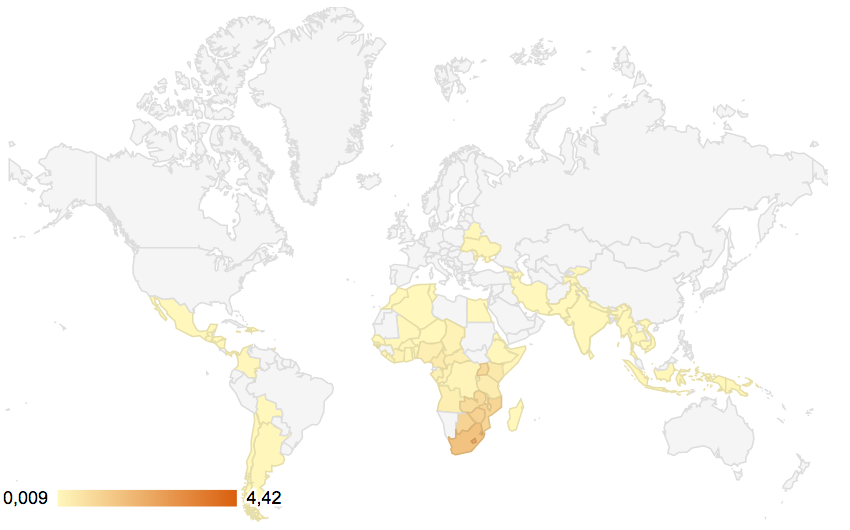


##
### 


##
###


##
###
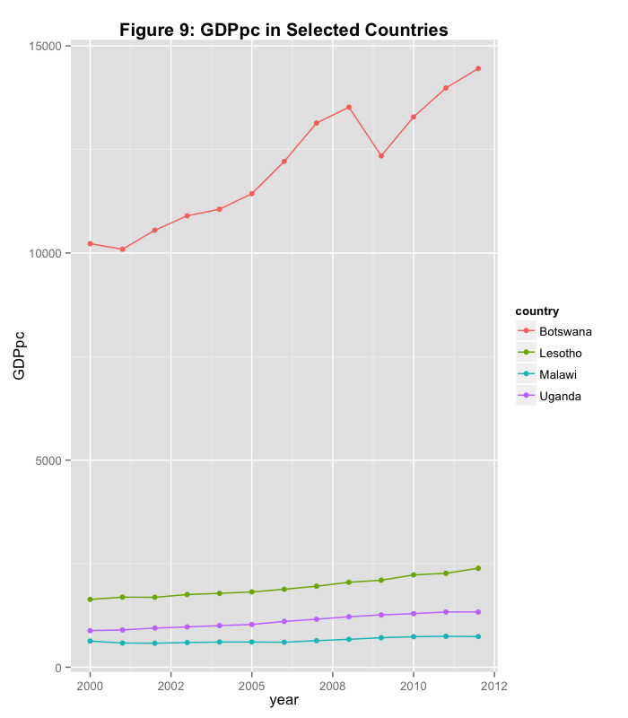

##
###
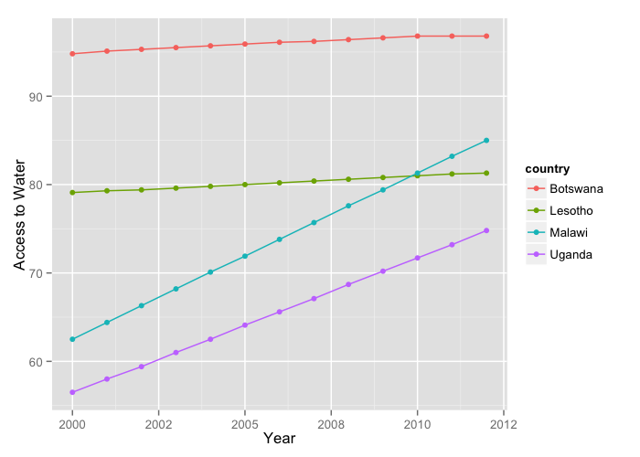

##
###
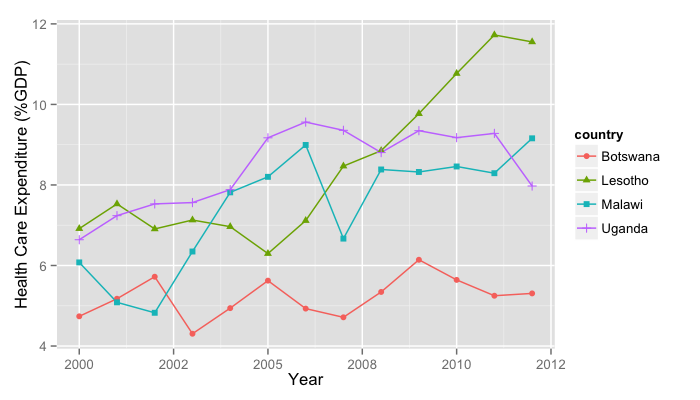


##
###


##
###


## The Model

To answer our research question we will estimate the following equation:

$$ I_{it} = {\beta}_0 +{\beta}_1 SE_{it} + {\beta}_2 WLC_{it} + {\beta}_3 SCN_{it} + {\beta}_4 ILF_{it} + {\epsilon}_{it}$$

Where I stands for HIV/AIDS incidence, SE stands for socioeconomic factors, WLC stands for working and living conditions, SCN stands for social and community networks and ILF stands for individual lifestyle factors. 
 

## Imputed missing values

```{r, echo=FALSE, include=FALSE}

# Load packages
# install.packages("Amelia")  
library(Amelia) 
#install.packages("Zelig")
library(Zelig)
#install.packages("knitr")
library(knitr)

# Load data
Merged <- read.csv(file="MergedData2")

Merged$X <- NULL

# Impute data
Imputed.out <- amelia(Merged, m = 5, ts = "year", cs = "iso2c", idvars = "country", ords= c("QFemSchool", "Dummy", "DDif"))
```

```{r, echo = FALSE, message=FALSE, warning=FALSE, error=FALSE,fig.width=19, fig.height=12, dpi=150}
# Plot imputed variables
plot(Imputed.out, which.vars=4:13)
?plot
```

## Logistic Regression Results

```{r, echo=FALSE, include=FALSE}
#### MODEL 1.1 - Running a general logistic regression using all independent variables

Model1.out <- zelig(Dummy ~ lGDPpc + lRural + lCO2 + lHCexpend + lWater + lSanitation + lLifeExpect + lDPT + lMeasles + Inverse + lFemSchool, data = Imputed.out, model = "logit")

```

```{r, echo=FALSE, results="asis", error=FALSE}

# Regression Results of Logistic Regression
knitr::kable(as.data.frame(summary(Model1.out)$coef))
#row.names=c("Intercept", "GDP per capital", "Rural Population", "CO2 Emissions", "Healthcare Expenditure", "Access to Water", "Access to Sanitation", "Life Expectancy", "Immunisation against DPT", "Immunisation against Measles", "Female Unemployment Rate", "Female School Enrollment")
```


## Predicted Probabilities

## Malawi

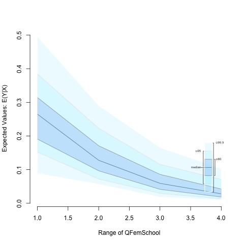

## Malawi 2

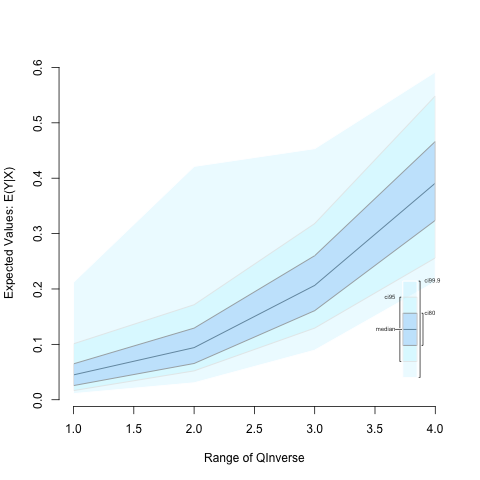

## Botswana

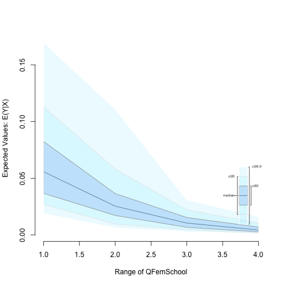

## Botswana 2

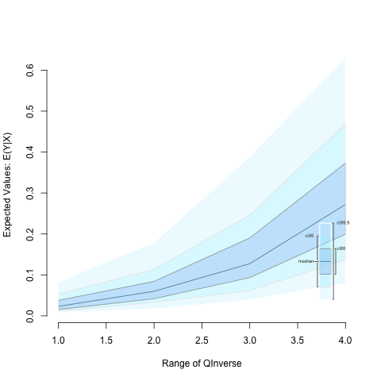

## Lesotho

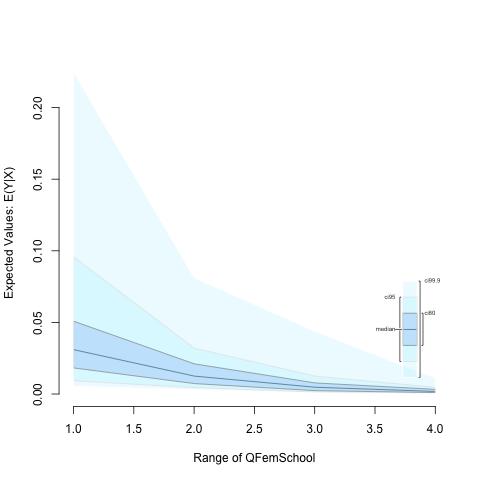

## Lesotho 2

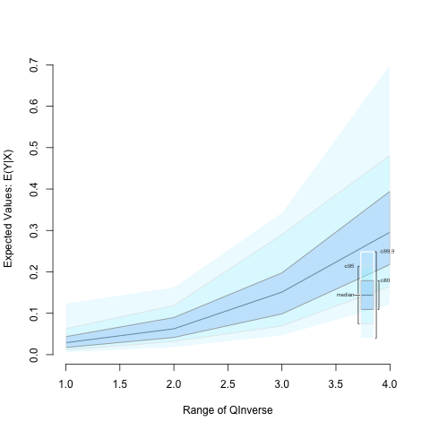

## Uganda

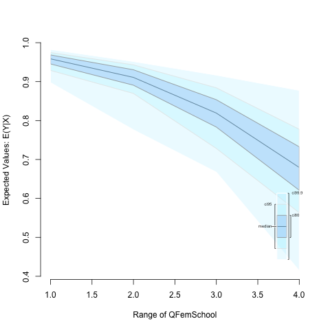

## Uganda 2

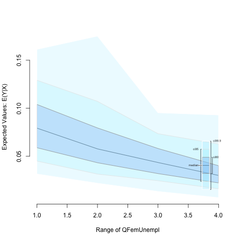

## Conclusions and Limitation


