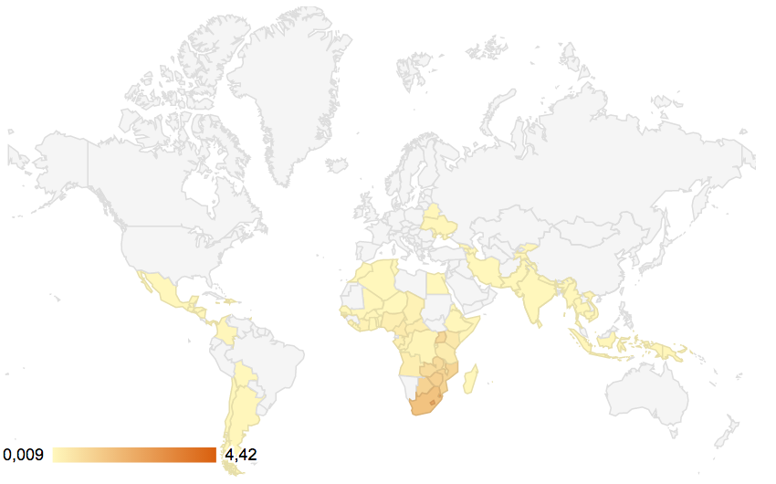

---

## Presentation Outline

- Research Question & Motivation
- Theoretical Framework
- Methodology
- Descriptive Statistics 
- Findings
- Conclusion & Limitations

## Research Question & Motivation

**Research Question: Are community level factors significant determinants of HIV/AIDS incidence rates?**

1. Understand why some countries failed to achieve MDG 6A

- *MDG 6: "Combat HIV/AIDS, Malaria and other diseases"*

- *Target 6A: "Have halted by 2015 and begun to reverse the spread of HIV/AIDS"*

2. Explore disease-specific determinants of health


## Theoretical Framework - Determinants of Health


## Methodology

**Model**
$$ I_{it} = {\beta}_0 +{\beta}_1 SE_{it} + {\beta}_2 WLC_{it} + {\beta}_3 SCN_{it} + {\beta}_4 ILF_{it} + {\epsilon}_{it}$$

**Datasets**

- We will use the World Development Indicators (WDI) for the independent variables and a dataset from UNAIDS for the HIV/AIDS prevalence rate.

**Methodology**

- Model 1: Logistic Regression & Predicted Probabilities
- Model 2: Pooled OLS Regression 


## Distribution of HIV Incidence Rates



## HIV Incidence Rates over Time 


## Case Studies


## Female School Enrollment in Selected Countries


## Female Unemployment compared to Total Unemployment in Selected Countries

 

## Imputed Missing Values

```{r, echo=FALSE, include=FALSE}

# setwd("/Users/Meilin/Desktop/Collaborative Social Data/FinalProject")
setwd("/Users/Nico/Documents/Hertie/Social science data analysis/Final project/FinalProject")

# Load packages
# install.packages("Amelia")  
library(Amelia) 
#install.packages("Zelig")
library(Zelig)
#install.packages("knitr")
library(knitr)
# install.packages("DataCombine")
library(DataCombine)

# Load data
Merged <- read.csv(file="MergedData2")

Merged$X <- NULL

# Impute data
Imputed.out <- amelia(Merged, m = 5, ts = "year", cs = "iso2c", idvars = "country", ords= c("QFemSchool", "Dummy"))
```

```{r, echo = FALSE, message=FALSE, warning=FALSE, error=FALSE,fig.width=19, fig.height=12, dpi=150}
# Plot imputed variables
plot(Imputed.out, which.vars=4:13)
?plot
```

## Logistic Regression Results - Model 1

```{r, echo=FALSE, include=FALSE}
#### MODEL 1.1 - Running a general logistic regression using all independent variables

Model1.out <- zelig(Dummy ~ lGDPpc + lRural + lCO2 + lHCexpend + lWater + lSanitation + lLifeExpect + lDPT + lMeasles + lFemSchool + ShFemUnempl, data = Imputed.out, model = "logit")

```


```{r, echo=FALSE, results="asis", error=FALSE, fig.width=19, fig.height=12, dpi=150}
# Regression Results of Logistic Regression

# create table with nice labels
Variables <- c("Constant", "GDP per capita", "Share of Rural Population", "CO2 Emissions per capita", "Healthcare Expenditure", "Access to Water", "Access to Sanitation", "Life Expectancy", "Immunisation against DPT", "Immunisation against Measles", "Female School Enrollment", "Share of Female Unemployment")
labels_1 <- as.data.frame(summary(Model1.out)$coef)
labels_1$Variables <- Variables
labels_1 <- MoveFront(labels_1, "Variables")
names(labels_1) <- c("Variables", "Coefficients", "Std. Error", "T-Statistic", "P-Value")
knitr::kable(labels_1, digits = 2, row.names = FALSE, caption = "Logistic Regression Results of Model 1")
```

```{r, echo=FALSE, include=FALSE}
## Predicted Probabilities - Female School Enrollment

#### MODEL 1 - Calculating predicted probabilities for Quintiles of Female School Enrollment for the Scenario Uganda

Model2.out <- zelig(Dummy ~ lGDPpc + lRural + lCO2 + lHCexpend + lWater + lSanitation + lLifeExpect + lDPT + lMeasles + QFemSchool + ShFemUnempl, data = Imputed.out, model = "logit")


# Fixing the Uganda Scenario, letting Quintiles of Female School Enrollment vary
Uganda1.out <-  setx(Model2.out, 
              lGDPpc = 7.00, 
              lRural = 4.46,
              lCO2 = -2.44,
              lHCexpend = 2.12,
              lLifeExpect = 3.98,
              lWater = 4.18,
              lSanitation = 3.46,
              lDPT = 4.20,
              lMeasles = 4.24,
             QFemSchool = 1:4)

# Calculating the Predicted Probabilities
Uganda1.out <- sim(Model2.out, x = Uganda1.out)
```


```{r, echo=FALSE, include = FALSE}
#### MODEL 1 - Calculating predicted probabilities for Quintiles of Female School Enrollment for the Scenario Lesotho


# Fixing the Lesotho Scenario, letting Quintiles of Female School Enrollment vary
Lesotho1.out <-  setx(Model2.out, 
              lGDPpc = 7.56, 
              lRural = 4.35,
              lCO2 = -3.31,
              lHCexpend = 2.11,
              lLifeExpect = 3.82,
              lWater = 4.38,
              lSanitation = 3.29,
              lDPT = 4.49,
              lMeasles = 4.41,
              QFemSchool = 1:4)

# Calculating the Predicted Probabilities
Lesotho1.out <- sim(Model2.out, x = Lesotho1.out)

```


```{r, echo=FALSE, include=FALSE}

#### MODEL 1 - Calculating predicted probabilities for Quintiles of Female School Enrollment for the Scenario Malawi

# Fixing the Malawi Scenario, letting Quintiles of Female Female School Enrollment vary
Malawi1.out <-  setx(Model2.out, 
              lGDPpc = 6.47, 
              lRural = 4.44,
              lCO2 = -2.67,
              lHCexpend = 1.99,
              lLifeExpect = 3.91,
              lWater = 4.30,
              lSanitation = 2.33,
              lDPT = 4.48,
              lMeasles = 4.42,
              QFemSchool = 1:4)

# Calculating the Predicted Probabilities
Malawi1.out <- sim(Model2.out, x = Malawi1.out)

```

```{r, echo=FALSE, include=FALSE}

#### MODEL 1 Calculating predicted probabilities for Quintiles of Female School Enrollment for the Scenario Botswana


# Fixing the Botswana Scenario, letting Quintiles of Female Female School Enrollment vary
Botswana1.out <-  setx(Model2.out, 
              lGDPpc = 9.39, 
              lRural = 3.80,
              lCO2 = 0.925,
              lHCexpend = 1.65,
              lLifeExpect = 3.86,
              lWater = 4.56,
              lSanitation = 4.07,
              lDPT = 4.57,
              lMeasles = 4.53,
              QFemSchool = 1:4)

# Calculating the Predicted Probabilities
Botswana1.out <- sim(Model2.out, x = Botswana1.out)

```


```{r, echo=FALSE, message=FALSE, error=FALSE, fig.width=19, fig.height=12, dpi=150}
# Plot predicted probabilities of Model 1 for Female School Enrollment
par(mfrow=c(2,2))
plot(Uganda1.out)
title(main="Scenario of Uganda", cex.main = 2)
plot(Lesotho1.out)
title(main="Scenario of Lesotho", cex.main = 2)
plot(Botswana1.out)
title(main="Scenario of Botswana", cex.main = 2)
plot(Malawi1.out)
title(main="Scenario of Malawi", cex.main = 2)

?kable

```


```{r, echo=FALSE, message=FALSE, error=FALSE, fig.width=19, fig.height=12, dpi=150}
# Plot predicted probabilities
par(mfrow=c(2,2))
plot(Uganda1.out)
plot(Lesotho1.out)
plot(Botswana1.out)
plot(Malawi1.out)
```

## Simple Linear Regression Results - Model 2

```{r, echo=FALSE, include=FALSE}
# Creating a Subset for countries with an HIV/AIDS incidence above the median - Model 2
HighInc <- Merged[which (Merged$Dummy==0), ]
 
# Duplicating our imputations
Imputed2.out <- Imputed.out

# Creating the subset with countries above the mean with a loop for all 5 imputations
for (i in 1:5){
  Imputed2.out$imputations[[i]] <- Imputed2.out$imputations[[i]][which(Imputed.out$imputations[[i]]$Incidence>=0.07), ]
}
 
# Running a linear pooled OLS regression

b.out <- zelig(lIncidence ~ lGDPpc + lRural + lCO2 + lHCexpend + lWater + lSanitation + lLifeExpect + lDPT + lMeasles + lFemSchool + ShFemUnempl, data = Imputed2.out, model = "ls")
 
summary(b.out)

#plot(b.out)
 
# Linear pooled OLS regression with robust standard errors
 
c.out <- zelig(lIncidence ~ lGDPpc + lRural + lCO2 + lHCexpend + lWater + lSanitation + lLifeExpect + lDPT + lMeasles + lFemSchool + ShFemUnempl, data = Imputed2.out, model = "ls", robust= "weave")


summary(c.out)
 
```
 
 
```{r, echo=FALSE, results="asis", error=FALSE}
 
# Linear pooled OLS regression with robust standard errors
Variables <- c("Constant", "GDP per capita", "Rural Population", "CO2 Emissions", "Healthcare Expenditure", "Access to Water", "Access to Sanitation", "Life Expectancy", "DPT Immunisation", "Measles Immunisation", "Female School Enrollment", "Female Unemployment Share")
labels_3 <- as.data.frame(summary(c.out)$coef)
labels_3$Variables <- Variables
labels_3 <- MoveFront(labels_3, "Variables")
names(labels_3) <- c("Variables", "Coefficients", "Std. Error", "T-Statistic", "P-Value")
knitr::kable(labels_3, digits = 2, row.names = FALSE, caption = "OLS Regression Results of Model 2 with robust standard errors", longtable=TRUE)
 
```


## Conclusions & Limitations - Model 1

1. **Logistic Regression Results of Model 1 (all countries)**
- Generally in line with hypothesis
- Most of the variables are statistically significant
- Only Immunisation Variables and GDP per capital are not significant

2. **Predicted Probabilities of Model 1 (selected countries)**
- Direction of effect of Female School Enrollment matches initial assumptions for all case studies
- Direction of effect of Female Unemployment does not match initial assumptions for any case study

## Conclusions & Limitations - Model 2

3. **Linear Regression of Model 2 (countries with incidence above mean)**
- Significance of some variables changes
- Female School Enrollment and Female Unemployment remain highly significant
- Effect of Female School Enrollment becomes positive (!)

4. **Fixed Effects Regression of Model 2 (countries with incidence above mean)**
- Significance of some variables changes compared to simple linear model
- Female School Enrollment and Female Unemployment become insignificant
- Immunisation rates for DPT & Measles become highly significant (!)

