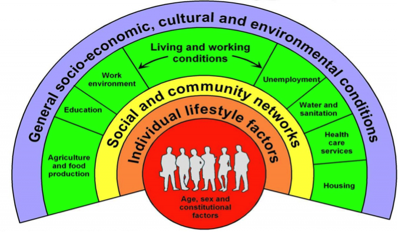

```{r, include=FALSE}

### 1. Setting Working Directory & Loading the data
# Setting the Working Directory
# setwd("/Users/Meilin/Desktop/Collaborative Social Data/FinalProject")
setwd("/Users/Nico/Documents/Hertie/Social science data analysis/Final project/FinalProject")

# Loading the Citations
pkgs <- c('ggplot2', 'googleVis', 'plyr')
repmis::LoadandCite(pkgs)

# Loading the merged files from the Working directory
Merged <- read.csv(file="MergedData")
# MergedOld <- read.csv(file="MergedOld")
```

# WELCOME

Welcome to our site and thank you for your interest in our research project!

Our names are Meilin Moellenkamp and Nicolas Rosemberg and we are jointly conducting a study on  determinants of HIV/AIDS. In our research, we explore which variables are significant determinants of HIV/AIDS incidence at the country level and test whether the data available supports our hypothesis, namely that social and community networks are important determinants of HIV/AIDS.

# WHY ARE WE INTERESTED IN THIS TOPIC?  

That is a good question. We believe that understanding the determinants of HIV/AIDS is an important step before designing complex interventions that try to tackle this global problem. 

Is it really a global problem? While HIV/AIDS incidence rates are highly concentrated in Southern Africa, we do observe that most countries in our sample consisting mostly of low- and middle-income countries suffer from this disease:

**Distribution of HIV/AIDS in low- and middle-income countries**

```{r, results='asis', echo=FALSE, error=FALSE}
IncidenceMap <- gvisGeoChart(Merged, locationvar = 'iso2c',
                        colorvar = 'Incidence',
                        options = list(
                          colors = "['#fff7bc', '#d95f0e']"
                        ))

print(IncidenceMap, tag = 'chart')
```
Source: UNAIDS 

If you are coming from one of the countries that are grey in the map and you are wondering, *"Is HIV not a problem in my country?"* Well, it might be! The grey countries are actually those countries for which data was insufficient. 

# REDUCING HIV FIGHTS POVERTY

Experts in the field of poverty reduction designed a list of goals that would help to reduce poverty across the world. These goals are called the Millenium Development Goals (MDGs) and the deadline to reach these goals is only some months away (September 2015). Halting and reversing the spread of HIV is one of these goals (MGD 6 - Target b). The inclusion of HIV control as one of the MDGs reflects that besides saving and improving people's lives, reducing HIV helps to fight poverty. 

Inspired by the puzzling question of why some countries failed to reach MDG6, we decided to embark ourselves in this research.

For more information on the MDGs please refer to the following links:


- *BACKGROUND INFORMATION*

**UNITED NATIONS**: http://www.un.org/millenniumgoals/

**ONE**: http://www.one.org/international/mdg/

- *PROGRESS REPORT*

**CENTER FOR GLOBAL DEVELOPMENT**: http://www.cgdev.org/page/mdg-progress-index-gauging-country-level-achievements


# HOW DID WE CONTRIBUTE TO THE EXISTING RESEARCH?

The first part of the research explored the existing literature on determinants of health and found that the papers on determinants of specific diseases mostly focus on a narrow range of variables. 

To fill this gap, we started by identifiying a model of general determinants of health that we could use to test for disease-specific determinants of health. We chose Dahlgren and Whitehead's model because it provides a simple yet comprehensive framework to identify variables. According to this model, there are a wide range of factors that influence our health, such as general socioeconomic factors, working and living conditions, social and community networks and individual factors (like smoking or drinking alcohol).

**Dahlgren and Whitehead's model**



*Source: Dahlgren and Whitehead (1991)*

While the (limited) literature on specific determinants of HIV mostly focused on socioeconomic factors and individual factors, there are not so many papers looking at the influence of social and community networks. This is why we decided to explore social and community factors and see whether they are significant to explain the incidence of HIV at the country level.

# CASE STUDY SELECTION

We were particularly interested in looking at some case studies to take a closer look at the relation between our selected variables. To choose the case studies we looked at the evolution of HIV incidence across time and selected the countries where incidence either strongly increased or strongly decreased or countries where incidence showed an erratic behaovior. From these sampled countries, we took 2 best practices (Botswana and Malawi, green lines) and two bad practices (Lesotho and Uganda, red lines).

**Case Studies**

```{r, results='asis', echo=FALSE, error=FALSE}

HighIncidence <- Merged[which (Merged$country=="Zimbabwe" | Merged$country=="Zambia"| Merged$country=="Swaziland" | Merged$country=="South Africa" | Merged$country=="Namibia" | Merged$country=="Mozambique" | Merged$country=="Lesotho" | Merged$country=="Malawi" | Merged$country=="Botswana"  | Merged$country=="Uganda"  | Merged$country=="Sierra Leone"  | Merged$country=="Papua New Guinea"), ] 

HighIncidence$CaseStudy <- HighIncidence$Incidence
HighIncidence$CaseStudy[HighIncidence$country=="Zimbabwe" | HighIncidence$country=="Zambia"| HighIncidence$country=="Swaziland" | HighIncidence$country=="South Africa" | HighIncidence$country=="Namibia" | HighIncidence$country=="Mozambique" | HighIncidence$country=="Sierra Leone"  | HighIncidence$country=="Papua New Guinea"] <-0
HighIncidence$CaseStudy[HighIncidence$country=="Lesotho" | HighIncidence$country=="Uganda"] <-2
HighIncidence$CaseStudy[HighIncidence$country=="Malawi" | HighIncidence$country=="Botswana"] <-1

Cases <- ggplot(data=HighIncidence, aes(x=year, y=Incidence, group=country, color=CaseStudy)) + geom_line() + geom_point() + ylab( "Incidence") + xlab("Year") + scale_color_gradient2(midpoint=1, low="grey", mid="darkgreen", high="darkred") + theme(legend.position="none")                                                                                                                                                      
                                                                                                                          
Cases <- Cases + theme(plot.title = element_text(lineheight=3, face="bold"))

print(Cases)
```


# WHAT DID WE FIND?

- We were interested in looking at the impact of two variables on HIV incidence rates. The first variable was female schooling. Early education represents an excellent opportunity to conduct HIV preventation campaigns before children become sexually active. Given that girls are more often negotiating for protected sex, we looked at the impact of female schooling on HIV incidence rates. We expected that this variable would be significant and have a negative impact on incidence, which means that higher female schooling would reduce HIV incidence. The data supported this hypothesis.

**Female School Enrollment - Case Studies**

```{r, results='asis', echo=FALSE, error=FALSE}

CaseStudies <-HighIncidence
CaseStudies <- CaseStudies[which (CaseStudies$country=="Lesotho" | CaseStudies$country=="Malawi" | CaseStudies$country=="Botswana"  | CaseStudies$country=="Uganda"), ] 


FemSchool <- ggplot(data=CaseStudies, aes(x=year, y=FemSchool, group=country, color=country, shape=country))  + geom_line () + geom_point()+ ylab( "Gross Female School Enrollment") + xlab("Year")

print(FemSchool)
```

- The second variable that we explore was the difference between female unemployment and total unemployment. We expected that a high rate of female employment to total unemployment would describe a society where women have relatively less power than men and this would mean that men could more easily bargain for unprotected sex. As a consequence, one would expect that a higher difference in female to total unemployment would be associated with higher HIV incidence rates. This hypothesis was not supported by out findings, according to which the difference between female and total unemployment has no impact on HIV incidence rates.

For a better understanding of the dynamics of our datasets, feel free to play with the following interactive tool: 

```{r, results='asis', echo=FALSE, error=FALSE}

Demo <- Merged
Demo <- Demo[,c(2:21)]
Demo <- plyr::rename(Demo, c("GDPpc" = "GDP per capita"))
Demo <- plyr::rename(Demo, c("Rural" = "Rural Population (%)"))
Demo <- plyr::rename(Demo, c("CO2" = "CO2 Emissions"))
Demo <- plyr::rename(Demo, c("HCexpend" = "Health Care Expenditure"))
Demo <- plyr::rename(Demo, c("Water" = "Access to Water"))
Demo <- plyr::rename(Demo, c("Sanitation" = "Access to Sanitation"))
Demo <- plyr::rename(Demo, c("Unemploym" = "Unemployment Rate"))
Demo <- plyr::rename(Demo, c("HCexpendpc" = "Health Care Expenditure per capita"))
Demo <- plyr::rename(Demo, c("FemSchool" = "Female School Enrollment"))
Demo <- plyr::rename(Demo, c("LifeExpect" = "Life Expectancy"))
Demo <- plyr::rename(Demo, c("DPT" = "Immunization against DPT"))
Demo <- plyr::rename(Demo, c("Measles" = "Immunization against Measles"))
Demo <- plyr::rename(Demo, c("FemUnempl" = "Female Unemployment Rate"))
Demo <- plyr::rename(Demo, c("Incidence" = "HIV Incidence Rate"))


M <- gvisMotionChart(Demo, "country", "year",
                     options=list(width=900, height=650))


print(M, tag = 'chart')
```

Choose from the dropdown list the variables that you will like to see in the x and y axis. If you want to change the color coding or make the size of the bubbles change according to the values of a specific variable, you can select that on the upper-right corner. If you are interested in the behavior of a particular country, you can select that on the lower-right corner. Also note that you can create bar and line charts by choosing the respective tab on the upper side of the tool.

We were particularly interested in looking at the evolution of HIV incidence rates (y axis) in relation to the evolution of female schooling (x axis). As you can see, while female schooling increases, HIV incidence rates decrease.


# SO... WHY IS THIS RELEVANT?

We believe that these findings can lead to interesting policy recommendations. 

1. **INVEST IN GIRLS EDUCATION:** If female schooling is a significant determinant of HIV, investing in female education is not only a good investment because it will improve the skills of women and increase their opportunities to get a job but also because it will make the population healthier thus reducing the costs of the health system.

2. **FURTHER EXPLORE THE LINK BETWEEN FEMALE LABOUR PARTICIPATION AND HIV INCIDENCE:** When looking at the difference between female and total unemployment, we realised that this indicator is not exactly portraying the variable that we wanted to analyze, namely female labour participation. It would be therefore interesting to test whether this variable is a good determinant of HIV before reaching any conclusion.

3. **LOOK AT MORE DETERMINANTS OF SPECIFIC DISEASES:** We realised that there is a gap in the literature exploring disease specific determinants of health regarding the impact of social and community level factors. It would be interesting to evaluate the determinants of other diseases and see whether these coincide with the determinants of HIV.


Thank you for visiting our website. If you have any questions, please contact us at m.moellenkamp@mpp.hertie-school.org or n.rosemberg@mpp.hertie-school.org